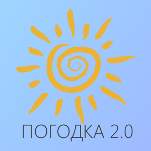

# Погодка 2.0 Расширение для информационной панели 1С Бухгалтерия 3.0

## Что это.
Виджет "Погодка 2.0" это блок информационной панели для конфигурации Бухгалтерия 3.0. На виджете отображается текущая погода в виде крупной картинки и прогноз на ближайшее время суток.

1. Установите расширение и отключите у него "Безопасный режим"
2. Укажите фактический адрес вашей организации
3. Воспользуйтесь кнопкой "Настройка", для того что бы разместить виджет на информационной панели
4. На начальной странице выберите организацию и...
5. Погодка 2.0 перед вам

Публикация на [Инфостарт](https://infostart.ru/public/801039/)

Шаблон расширения: [Vidjets_ACC30](https://github.com/infosoft-v/Vidjets_ACC30)

Поставщик погоды: [OpenWeatherMap](http://openweathermap.org/)